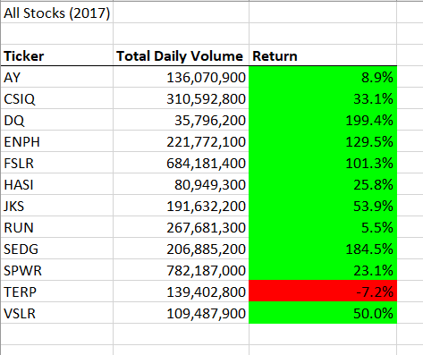
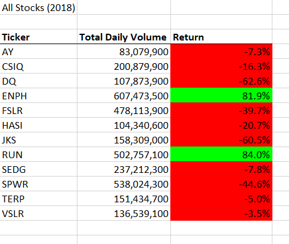
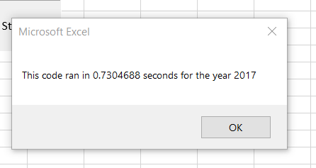
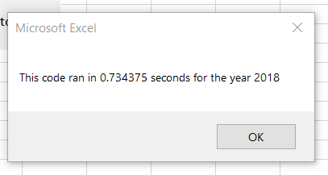
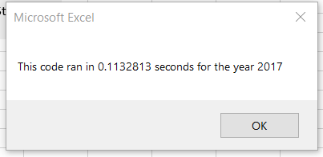
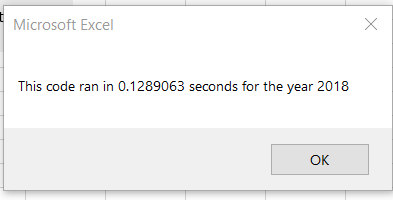

# **Clean Energy Stock Analysis for 2017 and 2018**

## Overview of Project
The analysis within this project was designed to show the successes and failures of various stocks in clean energy over a two-year time frame. The main purpose of this was to help our client determine which stocks have the highest percentage of returns within the years 2017 and 2018. This would, in turn, help the client make an informed decision when investing in the market and potentially lead to positive monetary success. 

## Results

### ***Comparing Stock Returns***

When observing the results above, one can determine that there are two clear good stocks to invest in -- ENPH and RUN. Both stocks have stayed in the green over a two-year period. If our client was only interesting in buying one stock, I would recommend ENPH, which saw a 129% return in 2017 and a 81% return in 2018, indicating that it has a strong positive trend over time. Alternatively, the RUN stock only saw a positive return of 5% in 2017 and 84% in 2018. 

### ***Looking at Code Run Times***

***original run time:***

***refactored run time:***

The refactored code was able to reduce the code run times by around 0.6 seconds. When we refactored the code, we simplified the way that the program accessed the data, which made the process more efficient. 

## Summary

### ***The Advantages and Disadvantages of Refactoring Code***

The most obvious advantage of refactoring code is that it runs faster once refactored. It can also make the code more readable and fix unknown errors that may have been hiding in the code before. 

A common disadvantage to refactoring code is that it can add bugs to your code and, if done wrong, will limit or cease functionality.

### ***The Pros and Cons of Refactoring the VBA Challenge***

The cons were making the refactored code actually work. There was a lot of trial and error before reaching the end result and a lot of starting from scratch. One could argue that the time spent making the code slightly more efficient was inefficient. 

The pros of refactoring this challenge come down to readability and accessibility. Our clients can determine the returns rapidly and with ease, which makes for a better presentation. Also, the code is easier to follow if another individual were to look at it in Excel. 

